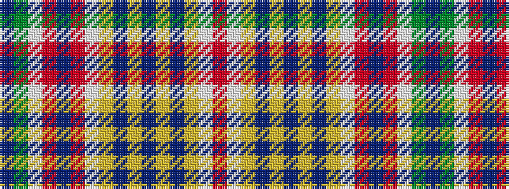

BGWRBRWYBYBYBYWR

It is a 16 stripe tartan.

<figure class="pat-woven">

<figcaption>idealised sample</figcaption>
</figure>

## Colour Sequence



## Tartans with this colour sequence

| Tartans |
|---------------|
| [Firenze ~ Florence](/setts/s16/r46w1ly3db1ly3db1ly3db1ly3w1r46dp14r2w2g2dp14~x2/)|
||
