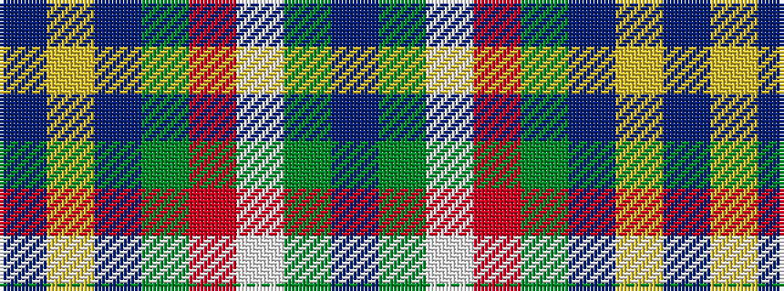

BGWRGBYB

It is a 8 stripe tartan.

<figure class="pat-woven">

<figcaption>idealised sample</figcaption>
</figure>

## Colour Sequence



## Tartans with this colour sequence

| Tartans |
|---------------|
| [Bahamas](/variants/s8/n8ly2n22dg6r2lb10dg12n3~x2/)|
||
| [Bahamas](/variants/s8/db3g11w11r2g7db22ly2db2~x2/)|
||
| [Bahamas (District)](/variants/s8/n8ly2n22g6r2lb10g12n3~x2/)|
||
| [Bahamas District Tartan](/variants/s8/db6ly2db22g7r2w11g11db3~x2/)|
||
