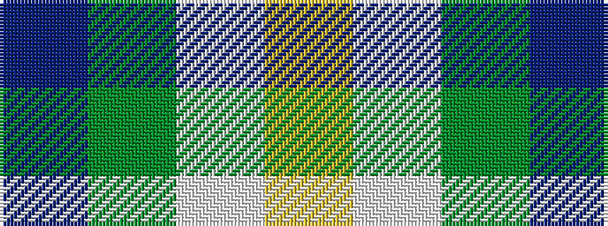

BGWY

It is a 4 stripe tartan.

<figure class="pat-woven">

<figcaption>idealised sample</figcaption>
</figure>

## Colour Sequence



## Tartans with this colour sequence

| Tartans |
|---------------|
| [Hsu (Personal)](/variants/s4/db60g16w8ly3~x2/)|
||
| [MaleHsuHK (Hong Kong) (Personal)](/variants/s4/db60dg16w8lo3~x2/)|
||
