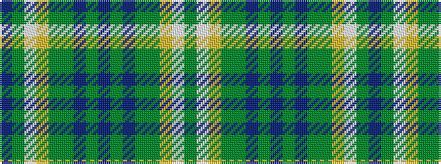

BGWYGGBGBGBGGYWG

It is a 16 stripe tartan.

<figure class="pat-woven">

<figcaption>idealised sample</figcaption>
</figure>

## Colour Sequence



## Tartans with this colour sequence

| Tartans |
|---------------|
| [St. Columba (two greens)](/setts/s16/db20yi1w1lo3y4g10n4yi1dp4~x2/)|
||
