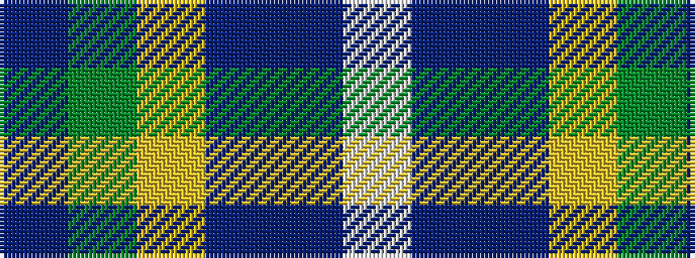

BGYBBW

It is a 6 stripe tartan.

<figure class="pat-woven">

<figcaption>idealised sample</figcaption>
</figure>

## Colour Sequence



## Tartans with this colour sequence

| Tartans |
|---------------|
| [Allanton (Fashion)](/variants/s6/t4g16ly2db7t28w4~x2/)|
||
| [Manx Laxey](/variants/s6/b4g16ly2p7b28w4~x2/)|
||
| [Manx Laxey (Blue)](/variants/s6/t4dg16ly2dp7t28w4~x2/)|
||
