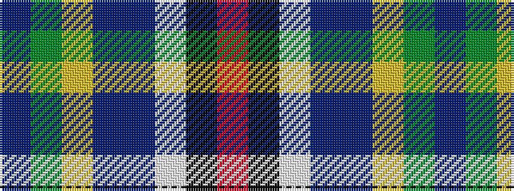

BGYBBWKR

It is a 8 stripe tartan.

<figure class="pat-woven">

<figcaption>idealised sample</figcaption>
</figure>

## Colour Sequence



## Tartans with this colour sequence

| Tartans |
|---------------|
| [Fremsaeter, Jenny (Personal)](/setts/s8/b32g5lr8db4dr5w5k5o8~x2/)|
||
