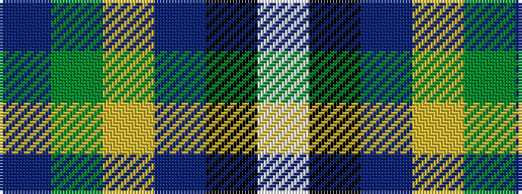

BGYBKW

It is a 6 stripe tartan.

<figure class="pat-woven">

<figcaption>idealised sample</figcaption>
</figure>

## Colour Sequence



## Tartans with this colour sequence

| Tartans |
|---------------|
| [Young, Christina](/variants/s6/w162k10dp10lo9y6dp3/)|
||
