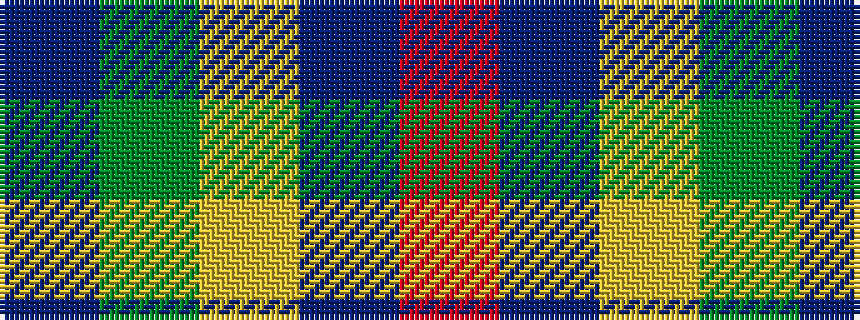

BGYBR

It is a 5 stripe tartan.

<figure class="pat-woven">

<figcaption>idealised sample</figcaption>
</figure>

## Colour Sequence



## Tartans with this colour sequence

| Tartans |
|---------------|
| [Creek Indian Nation](/variants/s5/db2g4ly1db1r2~x12/)|
||
