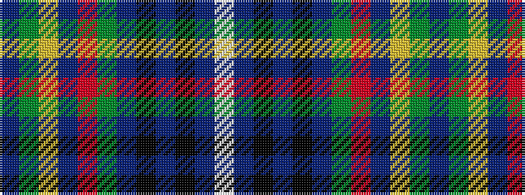

BGYBRGBKBKBW

It is a 12 stripe tartan.

<figure class="pat-woven">

<figcaption>idealised sample</figcaption>
</figure>

## Colour Sequence



## Tartans with this colour sequence

| Tartans |
|---------------|
| [Bhoyrub (Personal)](/variants/s12/b20g3ly3b3r7g6b3k12b3k3b24w3~x2/)|
||
| [Bhoyrub Clan/Family Tartan](/variants/s12/dt20g3ly3dt3r7g6dt3k12dt3k3dt24w3~x2/)|
||
