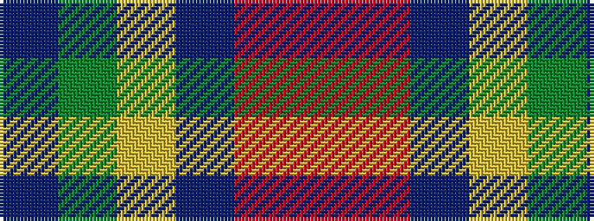

BGYBRR

It is a 6 stripe tartan.

<figure class="pat-woven">

<figcaption>idealised sample</figcaption>
</figure>

## Colour Sequence



## Tartans with this colour sequence

| Tartans |
|---------------|
| [British Judo Association](/setts/s6/r28r1b18ly2g6b18~x2/)|
||
| [European Judo Union](/setts/s6/r28r1db18ly2g1db18~x2/)|
||
