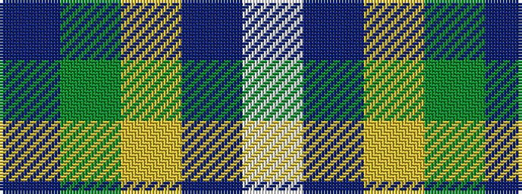

BGYBW

It is a 5 stripe tartan.

<figure class="pat-woven">

<figcaption>idealised sample</figcaption>
</figure>

## Colour Sequence



## Tartans with this colour sequence

| Tartans |
|---------------|
| [Manx Laxey Dress Green](/variants/s5/w14dp4ly1g8db2~x2/)|
||
