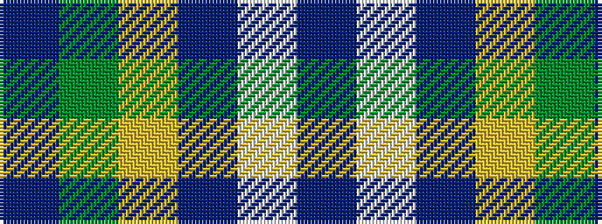

BGYBWB

It is a 6 stripe tartan.

<figure class="pat-woven">

<figcaption>idealised sample</figcaption>
</figure>

## Colour Sequence



## Tartans with this colour sequence

| Tartans |
|---------------|
| [Manx Laxey, dress green](/variants/s6/db2w14p4ly1g8db2~x2/)|
||
