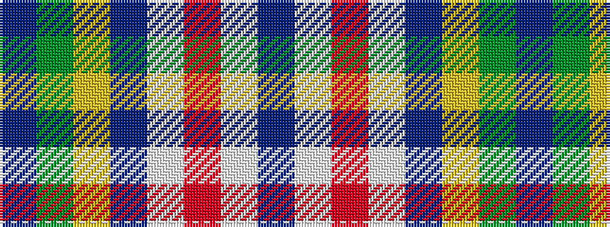

BGYBWRWB

It is a 8 stripe tartan.

<figure class="pat-woven">

<figcaption>idealised sample</figcaption>
</figure>

## Colour Sequence



## Tartans with this colour sequence

| Tartans |
|---------------|
| [Pictou County](/setts/s8/dp23w1o3w1dp12lo9dg40dp3~x2/)|
||
