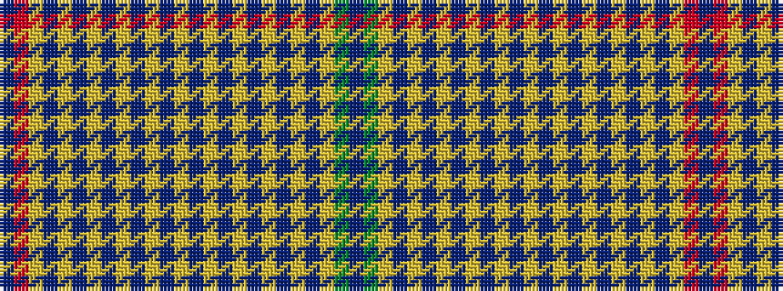

BGYBYBYBYBYBYBYBYBYBYBYRB

It is a 25 stripe tartan.

<figure class="pat-woven">

<figcaption>idealised sample</figcaption>
</figure>

## Colour Sequence



## Tartans with this colour sequence

| Tartans |
|---------------|
| [Allen Hunting (?Thomson)](/variants/s25/t22r1lo4t4lo1t1lo1t1lo1t1lo1t1lo1t1lo1t1lo1t1lo1t1lo1t1lo9dy24db2~x4/)|
||
