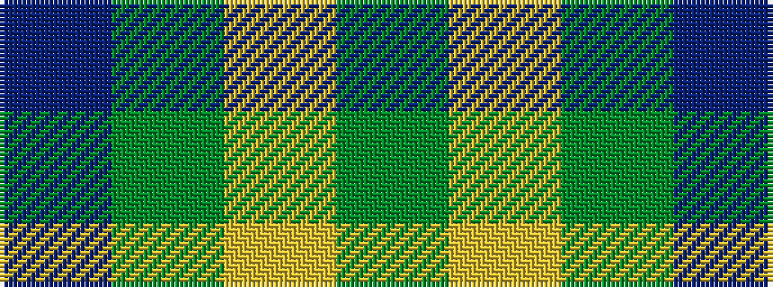

BGYG

It is a 4 stripe tartan.

<figure class="pat-woven">

<figcaption>idealised sample</figcaption>
</figure>

## Colour Sequence



## Tartans with this colour sequence

| Tartans |
|---------------|
| [Special Saffron (Fashion)](/variants/s4/dg21lo44dg86t10/)|
||
| [Special Saffron Tartan](/variants/s4/dg21ly43dg86t10/)|
||
| [Special, Saffron](/variants/s4/dg21lo43dg86b10/)|
||
