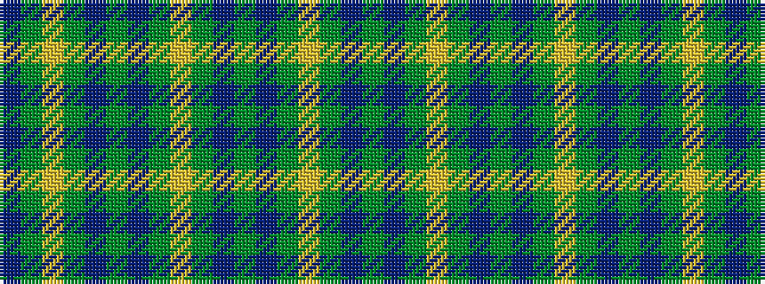

BGYGBGBGYGBGBGYGBG

It is a 18 stripe tartan.

<figure class="pat-woven">

<figcaption>idealised sample</figcaption>
</figure>

## Colour Sequence



## Tartans with this colour sequence

| Tartans |
|---------------|
| [Highland Hospice](/variants/s18/g51dp3g5lo3g5dp5g5dp5g5lo3~x2/)|
||
