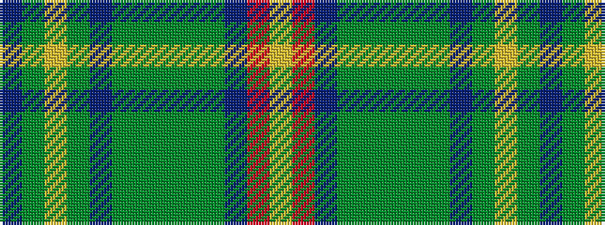

BGYGBGGGGGBRY

It is a 13 stripe tartan.

<figure class="pat-woven">

<figcaption>idealised sample</figcaption>
</figure>

## Colour Sequence



## Tartans with this colour sequence

| Tartans |
|---------------|
| [MacVicar, McVicar, McVicker](/variants/s13/n12dy2ly2dy2n2dy10y12dy3y12dy10n11r2ly2~x2/)|
||
| [MacVicker (Name)](/variants/s13/dt12dy2ly2dy2dt2dy10g10dy3g12dy10dt11r2ly2~x2/)|
||
