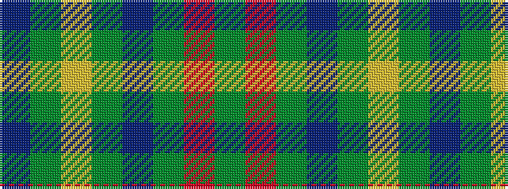

BGYGBGRG

It is a 8 stripe tartan.

<figure class="pat-woven">

<figcaption>idealised sample</figcaption>
</figure>

## Colour Sequence



## Tartans with this colour sequence

| Tartans |
|---------------|
| [Glenlivet Check (Corporate)](/variants/s8/dg18r6dg75b6dg13lo35dg12b6/)|
||
