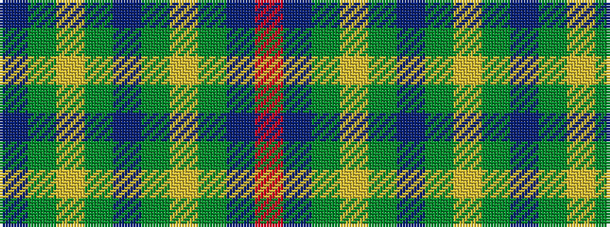

BGYGBGYGBR

It is a 10 stripe tartan.

<figure class="pat-woven">

<figcaption>idealised sample</figcaption>
</figure>

## Colour Sequence



## Tartans with this colour sequence

| Tartans |
|---------------|
| [Wheadon](/setts/s10/db15g7ly3g7db40g7ly3g7db15r5~x2/)|
||
