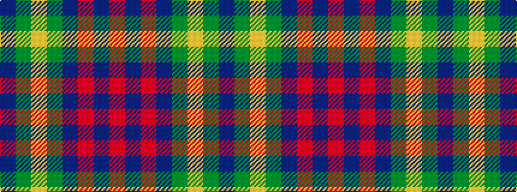

BGYGBRBR

It is a 8 stripe tartan.

<figure class="pat-woven">

<figcaption>idealised sample</figcaption>
</figure>

## Colour Sequence



## Tartans with this colour sequence

| Tartans |
|---------------|
| [Gretna Green](/variants/s8/db2g2ly1g30db20r2db2r2~x2/)|
||
