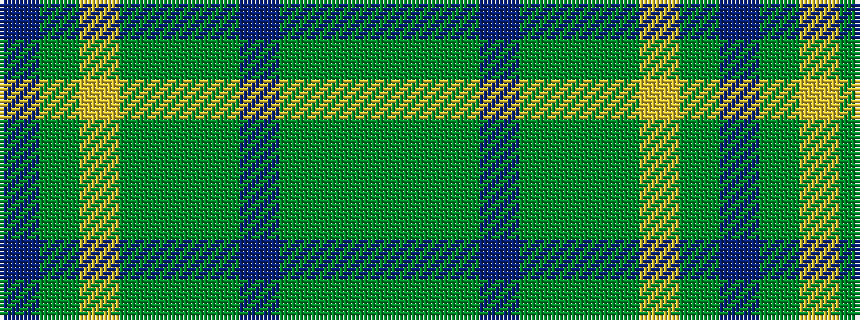

BGYGGGBGGG

It is a 10 stripe tartan.

<figure class="pat-woven">

<figcaption>idealised sample</figcaption>
</figure>

## Colour Sequence



## Tartans with this colour sequence

| Tartans |
|---------------|
| [Tupper. Sir Charles.. Family Tartan](/variants/s10/db4dy7ly3dy12g15dy5db20dy5g4dy2~x2/)|
||
