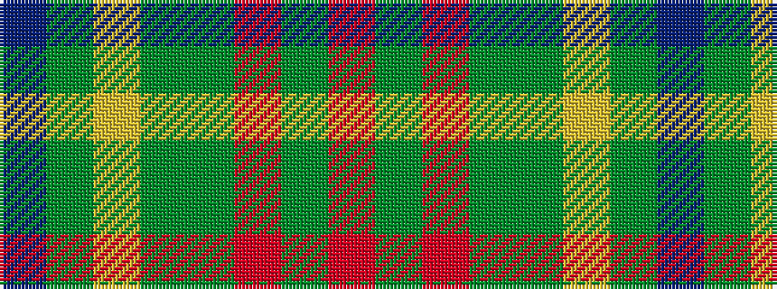

BGYGGRGR

It is a 8 stripe tartan.

<figure class="pat-woven">

<figcaption>idealised sample</figcaption>
</figure>

## Colour Sequence



## Tartans with this colour sequence

| Tartans |
|---------------|
| [Ballantyne (Personal) STWR](/variants/s8/db34dy9ly3dy9y30r3y11r5/)|
||
