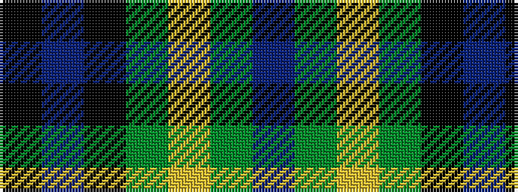

BGYGKBK

It is a 7 stripe tartan.

<figure class="pat-woven">

<figcaption>idealised sample</figcaption>
</figure>

## Colour Sequence



## Tartans with this colour sequence

| Tartans |
|---------------|
| [MacNiel of Colonsay](/setts/s7/db4dg6lr1dg6k6db6k2~x2/)|
||
