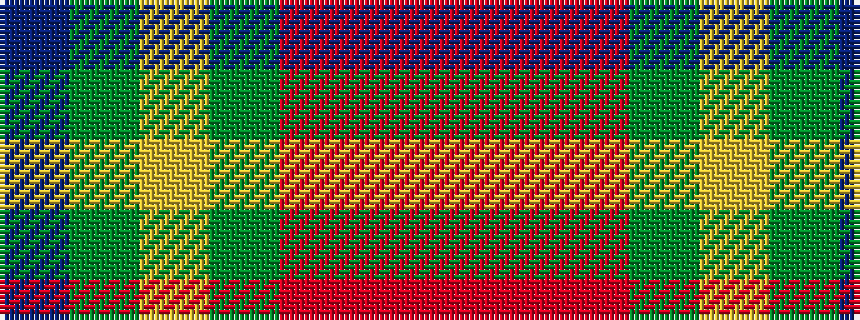

BGYGRRR

It is a 7 stripe tartan.

<figure class="pat-woven">

<figcaption>idealised sample</figcaption>
</figure>

## Colour Sequence



## Tartans with this colour sequence

| Tartans |
|---------------|
| [Isaia (Fashion)](/setts/s7/o80o8o4dy4lr4dy45n8/)|
||
