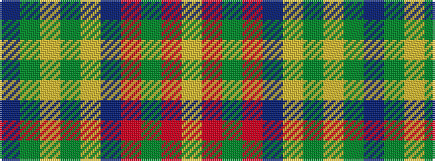

BGYGYBRGRY

It is a 10 stripe tartan.

<figure class="pat-woven">

<figcaption>idealised sample</figcaption>
</figure>

## Colour Sequence



## Tartans with this colour sequence

| Tartans |
|---------------|
| [Anthony Plaid Blue](/variants/s10/db18g1ly3g1lr1db1r2g2r2lr2~x4/)|
||
