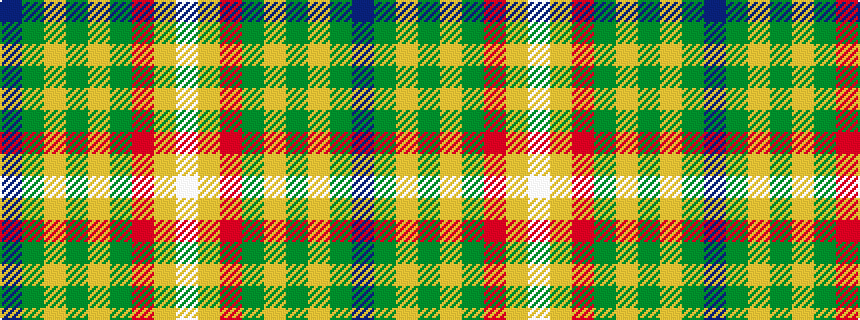

BGYGYGRYW

It is a 9 stripe tartan.

<figure class="pat-woven">

<figcaption>idealised sample</figcaption>
</figure>

## Colour Sequence



## Tartans with this colour sequence

| Tartans |
|---------------|
| [Gallagher Ancient](/variants/s9/db4dg41lo4g4lo4g9r18lo4w4~x2/)|
||
| [Gallagher Irish Fashion Tartan](/variants/s9/db4dg41lo4g4lo4g9o18lo4w4~x2/)|
||
