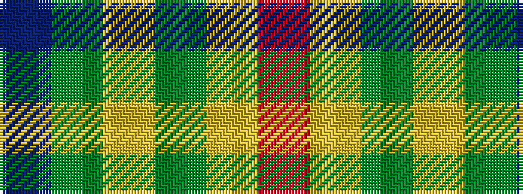

BGYGYR

It is a 6 stripe tartan.

<figure class="pat-woven">

<figcaption>idealised sample</figcaption>
</figure>

## Colour Sequence



## Tartans with this colour sequence

| Tartans |
|---------------|
| [Unidentfied (Ligioner Highland Games](/setts/s6/do4g25lo10g3lo18r4~x2/)|
||
