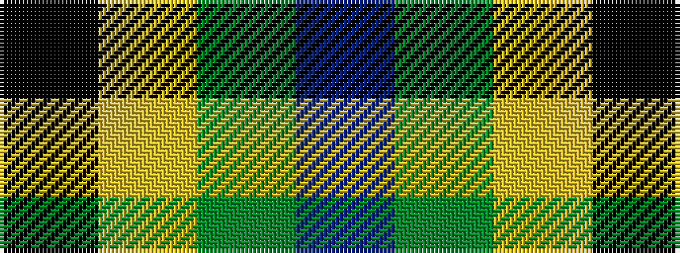

BGYK

It is a 4 stripe tartan.

<figure class="pat-woven">

<figcaption>idealised sample</figcaption>
</figure>

## Colour Sequence



## Tartans with this colour sequence

| Tartans |
|---------------|
| [Wilson's No.140](/variants/s4/k2ly1g7t1~x2/)|
||
| [Wilson's, No 140](/variants/s4/k7ly1g7t1~x2/)|
||
