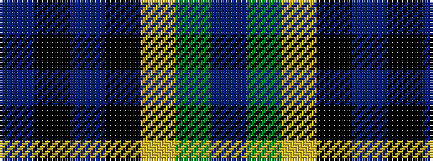

BGYKBKB

It is a 7 stripe tartan.

<figure class="pat-woven">

<figcaption>idealised sample</figcaption>
</figure>

## Colour Sequence



## Tartans with this colour sequence

| Tartans |
|---------------|
| [Hogarth of Firhill](/setts/s7/t2g6ly1k6db6k1db1~x2/)|
||
| [Hogarth of Firhill #2](/setts/s7/b2dg6ly1k6db6k1db1~x2/)|
||
| [Hogarth of Firhill (Clan)](/setts/s7/t4g14ly2k14db14k2db3~x2/)|
||
| [Hogarth, of Firhill](/setts/s7/b2g6ly1k6db6k1db1~x2/)|
||
