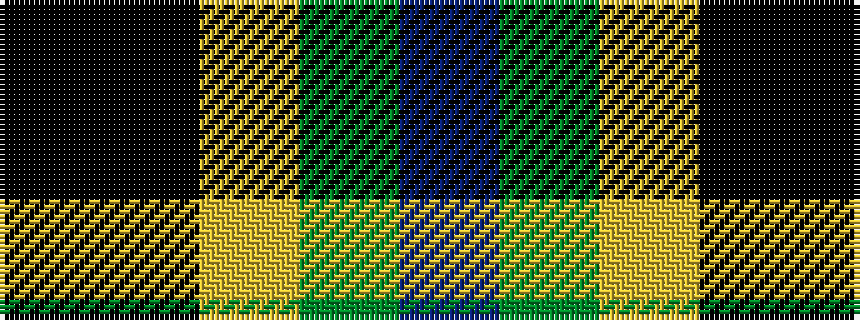

BGYKK

It is a 5 stripe tartan.

<figure class="pat-woven">

<figcaption>idealised sample</figcaption>
</figure>

## Colour Sequence



## Tartans with this colour sequence

| Tartans |
|---------------|
| [Eternity Fashion Tartan](/variants/s5/n88dy3lo2ki2k1~x2/)|
||
