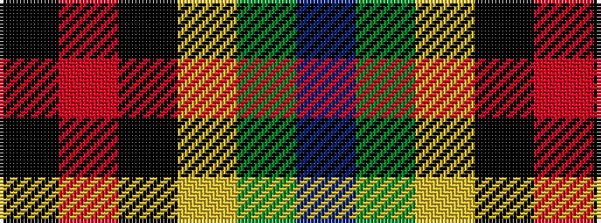

BGYKRK

It is a 6 stripe tartan.

<figure class="pat-woven">

<figcaption>idealised sample</figcaption>
</figure>

## Colour Sequence



## Tartans with this colour sequence

| Tartans |
|---------------|
| [Green Swamp Youth Campers](/setts/s6/k8r2k13lo2dg48b6~x2/)|
||
| [Green Swamp Youth Campers](/setts/s6/k8r2k13ly2dg48db6~x2/)|
||
