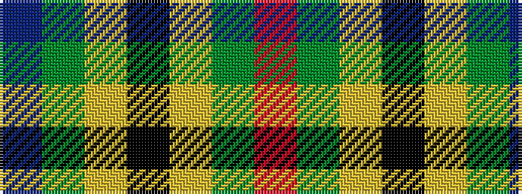

BGYKYGR

It is a 7 stripe tartan.

<figure class="pat-woven">

<figcaption>idealised sample</figcaption>
</figure>

## Colour Sequence



## Tartans with this colour sequence

| Tartans |
|---------------|
| [Nelson Mandela (Personal)](/setts/s7/db27g5ly8k20ly3g15r3~x2/)|
||
