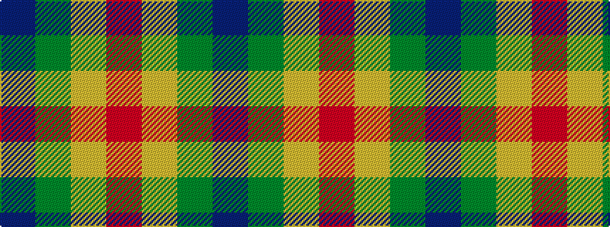

BGYR

It is a 4 stripe tartan.

<figure class="pat-woven">

<figcaption>idealised sample</figcaption>
</figure>

## Colour Sequence



## Tartans with this colour sequence

| Tartans |
|---------------|
| [Delroeux (Personal)](/variants/s4/db3g6ly1r3~x10/)|
||
| [Delroeux, John Michael (Personal)](/variants/s4/db3dg6ly1r3~x10/)|
||
