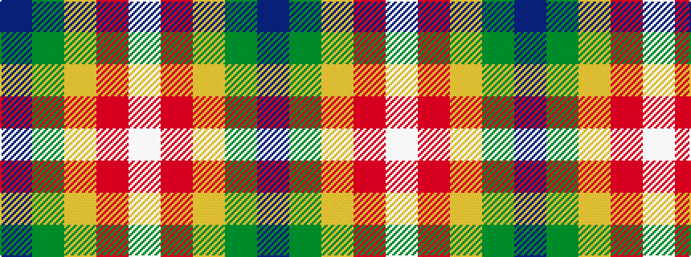

BGYRW

It is a 5 stripe tartan.

<figure class="pat-woven">

<figcaption>idealised sample</figcaption>
</figure>

## Colour Sequence



## Tartans with this colour sequence

| Tartans |
|---------------|
| [Milling-Christensen](/variants/s5/w8r6ly2g34b3~x2/)|
||
| [Milling-Kristensen (Personal)](/variants/s5/w8r6lo2g34b3~x2/)|
||
