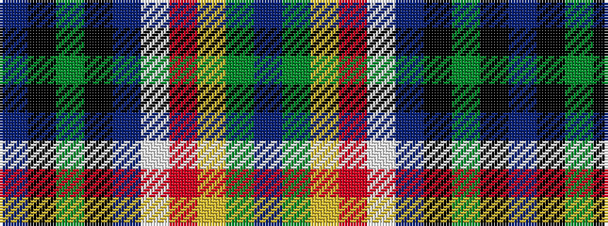

BGYRWBKGKB

It is a 10 stripe tartan.

<figure class="pat-woven">

<figcaption>idealised sample</figcaption>
</figure>

## Colour Sequence



## Tartans with this colour sequence

| Tartans |
|---------------|
| [Scotshill](/setts/s10/t13k14g6k14t14w1r1ly1g1t3~x2/)|
||
| [Scotshill](/setts/s10/b13k14g6k14b14w1r1ly1g1b3~x2/)|
||
