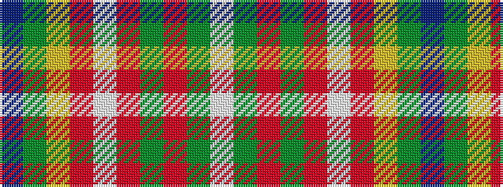

BGYRWRGRGW

It is a 10 stripe tartan.

<figure class="pat-woven">

<figcaption>idealised sample</figcaption>
</figure>

## Colour Sequence



## Tartans with this colour sequence

| Tartans |
|---------------|
| [Canadian Caledonian](/setts/s10/db3g16ly1r1w1r6g3r1g3w1~x4/)|
||
| [Canadian Caledonian](/setts/s10/db3g16ly1r1w1r6g3r1g3w1~x2/)|
||
