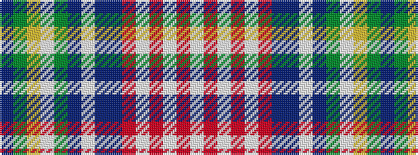

BGYWGBWBBRWRWRW

It is a 15 stripe tartan.

<figure class="pat-woven">

<figcaption>idealised sample</figcaption>
</figure>

## Colour Sequence



## Tartans with this colour sequence

| Tartans |
|---------------|
| [Culloden, Worn by Pr Charles](/setts/s15/b17g15ly5w2g8dp6w2db8dr32r18w2r8w2o50w2~x2/)|
||
