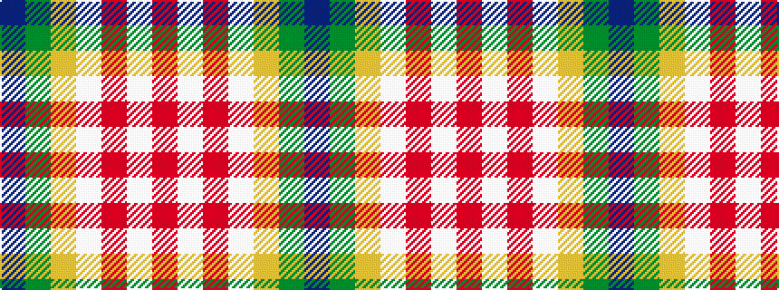

BGYWRWR

It is a 7 stripe tartan.

<figure class="pat-woven">

<figcaption>idealised sample</figcaption>
</figure>

## Colour Sequence



## Tartans with this colour sequence

| Tartans |
|---------------|
| [Wells (2014)](/variants/s7/dt50g25ly3lb8r1w1r1~x2/)|
||
