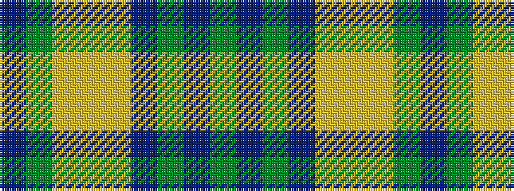

BGYYYBGBG

It is a 9 stripe tartan.

<figure class="pat-woven">

<figcaption>idealised sample</figcaption>
</figure>

## Colour Sequence



## Tartans with this colour sequence

| Tartans |
|---------------|
| [Organic](/variants/s9/y25p3y8p13lyi8lr2ly11y2p3~x2/)|
||
