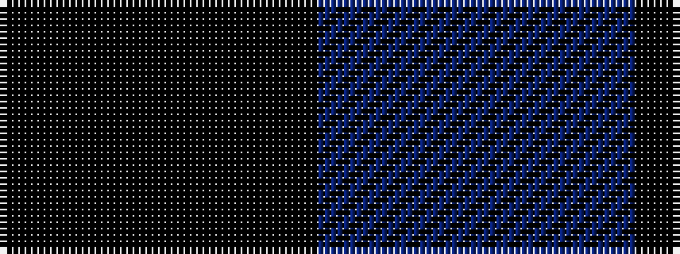

BK

It is a 2 stripe tartan.

<figure class="pat-woven">

<figcaption>idealised sample</figcaption>
</figure>

## Colour Sequence



## Tartans with this colour sequence

| Tartans |
|---------------|
| [Black Shadow (Fashion)](/setts/s2/k20n1~x6/)|
||
| [Buffalo Plaid](/setts/s2/k1db1~x100/)|
||
| [Staines](/setts/s2/db12k1~x10/)|
||
| [Tartan Army](/setts/s2/db2k1~x4/)|
||
| [Wilson's No.172](/setts/s2/k9t8~x2/)|
||
