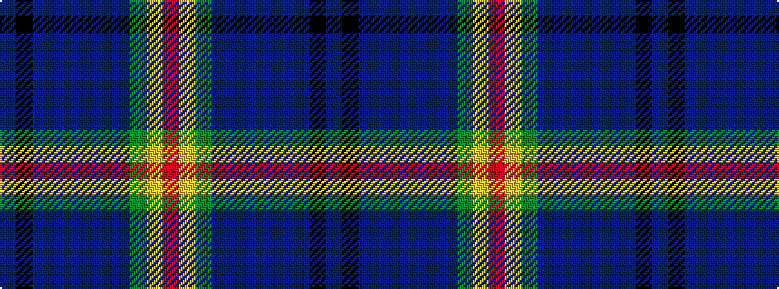

BKBBBBBBGYR

It is a 11 stripe tartan.

<figure class="pat-woven">

<figcaption>idealised sample</figcaption>
</figure>

## Colour Sequence



## Tartans with this colour sequence

| Tartans |
|---------------|
| [Century 21 (Fashion)](/variants/s11/db2k2db21dbi1db1dbi2db1dbi8dg23ly2r2~x2/)|
||
