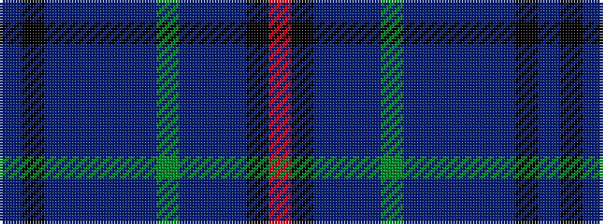

BKBBBBBGBBBKR

It is a 13 stripe tartan.

<figure class="pat-woven">

<figcaption>idealised sample</figcaption>
</figure>

## Colour Sequence



## Tartans with this colour sequence

| Tartans |
|---------------|
| [Leith](/setts/s13/b5k2b17db3b3db22b3dg22b3db3b27k2r4~x2/)|
||
| [Leith](/setts/s13/t5k2t17db3t3db22t3g22t3db3t27k2r4~x2/)|
||
