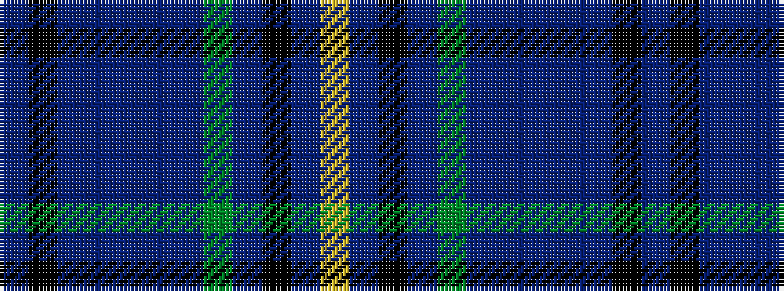

BKBBBBBGBKBY

It is a 12 stripe tartan.

<figure class="pat-woven">

<figcaption>idealised sample</figcaption>
</figure>

## Colour Sequence



## Tartans with this colour sequence

| Tartans |
|---------------|
| [Bavidge](/setts/s12/dbi92k14dbi18db5dbi5db5dbi5dg32dp16k5dp7ly8/)|
||
| [Bavidge (Personal)](/setts/s12/db92k14db18b5db5b5db5dg32dp16k5dp7ly8/)|
||
