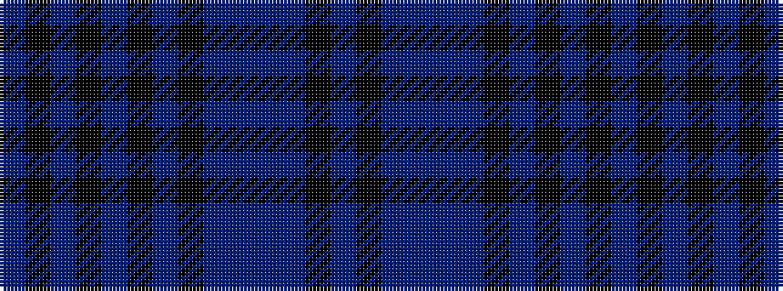

BKBBBBKBKBKBKB

It is a 14 stripe tartan.

<figure class="pat-woven">

<figcaption>idealised sample</figcaption>
</figure>

## Colour Sequence



## Tartans with this colour sequence

| Tartans |
|---------------|
| [Payne](/setts/s14/db2k1db4db5dp3db20k8db4k1db2k1db33k1db1~x2/)|
||
