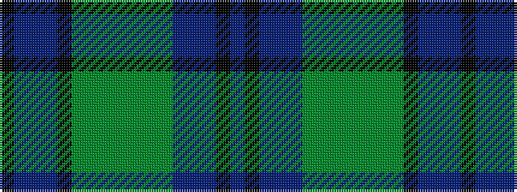

BKBBBGGGGGGGKBBBK

It is a 17 stripe tartan.

<figure class="pat-woven">

<figcaption>idealised sample</figcaption>
</figure>

## Colour Sequence



## Tartans with this colour sequence

| Tartans |
|---------------|
| [Sandilands-Watson (Personal)](/setts/s17/db24k2db2dp2db2dg16y1dg2y3dg2y1dg16k20db2dp2db2k2~x2/)|
||
