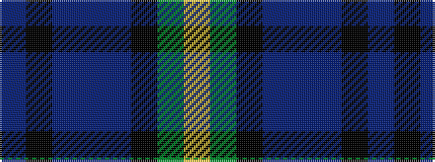

BKBBBKGY

It is a 8 stripe tartan.

<figure class="pat-woven">

<figcaption>idealised sample</figcaption>
</figure>

## Colour Sequence



## Tartans with this colour sequence

| Tartans |
|---------------|
| [Castellari of Lochaber Lairds (Pers](/setts/s8/db2k2dp1dbi30t1k12dg25lo1~x2/)|
||
