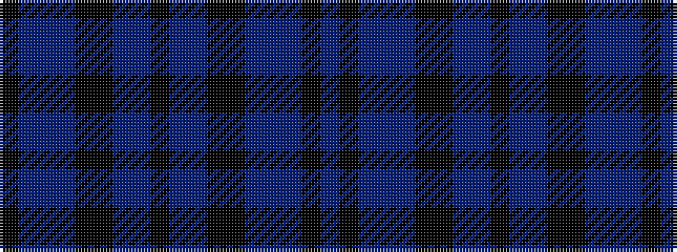

BKBBBKKBBKBBKKBBBK

It is a 18 stripe tartan.

<figure class="pat-woven">

<figcaption>idealised sample</figcaption>
</figure>

## Colour Sequence



## Tartans with this colour sequence

| Tartans |
|---------------|
| [Hughes (USA) (Personal)](/variants/s18/ki12db3b4db3ki3k36db3b2k3b2db3k36ki3db3b4db3ki12b4~x2/)|
||
