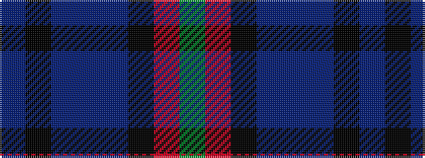

BKBBBKRG

It is a 8 stripe tartan.

<figure class="pat-woven">

<figcaption>idealised sample</figcaption>
</figure>

## Colour Sequence



## Tartans with this colour sequence

| Tartans |
|---------------|
| [Suttle (Personal)](/setts/s8/n36k18n5dt7n5k7r1g2~x2/)|
||
