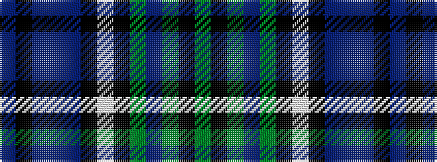

BKBBBKWKGBGKG

It is a 13 stripe tartan.

<figure class="pat-woven">

<figcaption>idealised sample</figcaption>
</figure>

## Colour Sequence



## Tartans with this colour sequence

| Tartans |
|---------------|
| [Redgate (Connecticut) #2](/setts/s13/dg1k4dg6dr3dg6ki10w1ki10n9dr3n9k5n1~x2/)|
||
