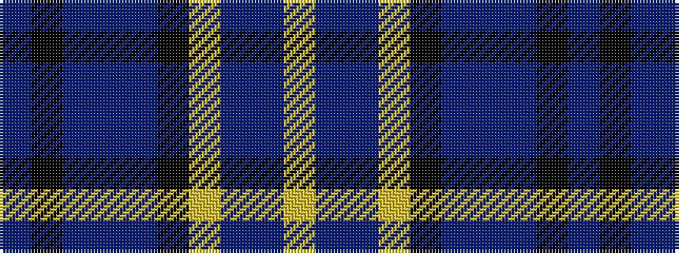

BKBBBKYBBY

It is a 10 stripe tartan.

<figure class="pat-woven">

<figcaption>idealised sample</figcaption>
</figure>

## Colour Sequence



## Tartans with this colour sequence

| Tartans |
|---------------|
| [Hughes (USA) (Name)](/setts/s10/b4k12db3b4db3k3ly36db3b2ly3~x2/)|
||
